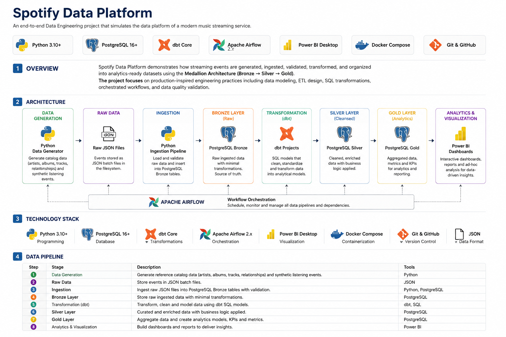

# Spotify Data Platform

An end-to-end Data Engineering project that simulates the data platform of a modern music streaming service.

The platform combines reproducible synthetic listening activity with real-world music catalog metadata sourced from MusicBrainz.

The project demonstrates how data from multiple sources can be ingested, transformed and prepared for analytics using a Medallion Architecture approach (Bronze → Silver → Gold).

The main focus is on building production-inspired data pipelines, applying data modeling principles, implementing data quality practices and creating analytics-ready datasets.

---

# Architecture



The platform follows a layered data architecture with two primary data sources:

- **Listening Events:** 500,000 reproducible synthetic listening events generated using Python.
- **Music Catalog:** Real artist, track and album metadata sourced from MusicBrainz.
- **Raw Data Layer:** Source data stored as JSON files before ingestion.
- **Ingestion Layer:** Python pipelines load raw data into PostgreSQL.
- **Bronze Layer:** Raw ingested data stored with minimal transformation.
- **Silver Layer:** Cleaned, standardized and validated datasets.
- **Gold Layer:** Analytics-ready models containing aggregated metrics and business insights.
- **Analytics Layer:** Reporting and visualization through Power BI.

Both data sources flow through the same Medallion Architecture:

```text
Synthetic Listening Events        MusicBrainz Catalog
          |                               |
          +---------------+---------------+
                          |
                          v
                       Bronze
                          |
                          v
                       Silver
                          |
                          v
                        Gold
                          |
                          v
                  Analytics / Power BI

Apache Airflow will be used for workflow orchestration and pipeline scheduling.

---

# Technology Stack

| Category         | Technology        |
| ---------------- | ----------------- |
| Programming      | Python            |
| Database         | PostgreSQL        |
| Query Language   | SQL               |
| Data Format      | JSON              |
| External Data    | MusicBrainz API   |
| Transformations  | SQL / dbt         |
| Orchestration    | Apache Airflow    |
| Analytics        | Power BI          |
| Containerization | Docker Compose    |
| Version Control  | Git & GitHub      |

---

# Data Pipeline

The platform follows a batch-oriented data processing workflow:

| Stage | Description |
| --- | --- |
| Data Sources | Generate synthetic listening events and retrieve real music catalog metadata from MusicBrainz |
| Raw Data | Store source data as JSON files |
| Ingestion | Load raw datasets into PostgreSQL using Python pipelines |
| Bronze Layer | Preserve ingested source data with minimal transformation |
| Silver Layer | Clean, standardize and validate listening and catalog datasets |
| Gold Layer | Build analytical models and aggregated metrics |
| Analytics | Visualize insights through Power BI dashboards and reports |

The catalog uses a relational model supporting artists, tracks, albums and many-to-many track-artist relationships, allowing collaborations and tracks without an associated album.

---

# Project Progress & Roadmap

## Completed

- Generation of 500,000 reproducible synthetic listening events
- Integration with the MusicBrainz API for real music catalog metadata
- Batch-based JSON data ingestion
- PostgreSQL database setup using Docker Compose
- Bronze layer ingestion
- Silver layer transformations
- Relational catalog data model
- Many-to-many track-artist relationships
- Data cleaning and standardization
- Data quality validation queries and relational integrity checks

## In Progress

- Gold analytical models
- Catalog integration and validation
- Project documentation

## Future Improvements

- Introduce dbt for transformation management and testing
- Introduce Apache Airflow for workflow orchestration and scheduling
- Create Power BI dashboards
- Add automated pipeline testing
- Improve monitoring and data quality observability

---

This project is continuously evolving as additional Data Engineering concepts and technologies are introduced.